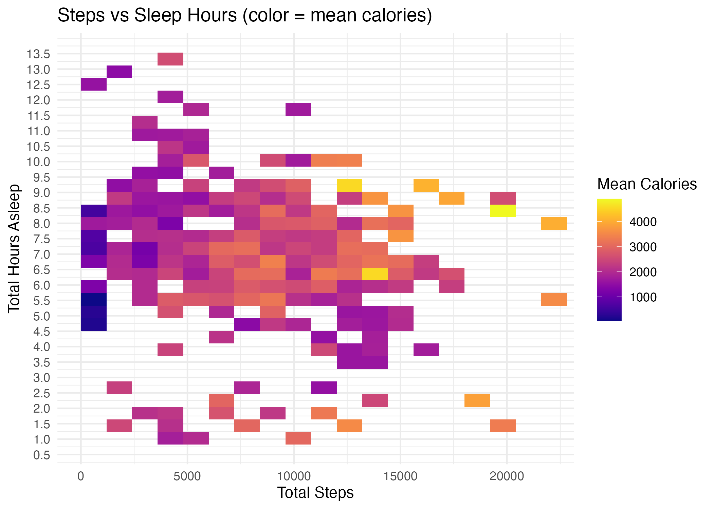

<!--
Bellabeat Case Study — README
Brand accents: Purple #6E44FF  |  Orange #FF7A00
-->

<p align="center">
  
</p>

<h1 align="center">Bellabeat Case Study — Fitbit Data Analysis</h1>

<p align="center">
  <a href="https://img.shields.io/badge/Made%20with-R-6E44FF?logo=r&logoColor=white"></a>
  <a href="https://img.shields.io/badge/dataset-CC0-FF7A00"></a>
  <a href="https://img.shields.io/badge/status-Completed-brightgreen"></a>
</p>

<p align="center">
  <a href="Bellabeat_Case_Study.html"></a>
  <a href="Bellabeat_Case_Study.pdf"></a>
  <a href="slides/Bellabeat_Case_Study_Slides.pptx"></a>
  <a href="slides/Bellabeat_Case_Study_Slides_PDF.pdf"></a>
</p>

---

## 🟣 Overview
Analysis of public **Fitbit tracker data** to uncover trends in **steps, sleep, calories, and activity mix**, translated into **marketing recommendations** for Bellabeat.

**Deliverables included here:**  
- Knit report (**HTML** + **PDF**)  
- Slide deck (**PPTX** + **PDF**)  
- Reproducible R Markdown workflow  
- Exported plots (PNG)

---

## 🟠 Dataset
- **Source:** Fitbit Fitness Tracker Data (Mobius / Kaggle, **CC0**)  
- **Windows:** 2016-03-12 → 2016-04-11 and 2016-04-12 → 2016-05-12  
- **Files used:** `dailyActivity_merged.csv`, `sleepDay_merged.csv`, `hourlySteps_merged.csv`  
- **Caveats:** small convenience sample; non-wear/missing days; not representative of all users

---

## 🔎 Key Findings (TL;DR)
- **Steps ↔ Calories:** Strong positive relationship; burn rises with step counts.  
- **Sleep + Steps:** Highest mean calories cluster around **~6–9 hours** sleep with **8k–12k steps**.  
- **Activity Mix:** **Light activity dominates**; very-active minutes are rare (room for micro-bursts).  
- **Weekday vs Weekend:** Similar odds of ≥10k steps; **weekend sleep more variable**.  
- **Hourly Peaks:** Activity spikes **mid-day** and **early evening**.

---

## 📈 Visualization Preview
> Steps × Sleep (color = mean calories)
<p>
  
</p>
<sub>Peak calorie burn appears with ~6–9 hours of sleep and 8k–12k steps.</sub>

---

## 🛠 How to Run Locally

```bash
git clone https://github.com/YOUR-USERNAME/bellabeat-fitbit-case-study.git
cd bellabeat-fitbit-case-study
